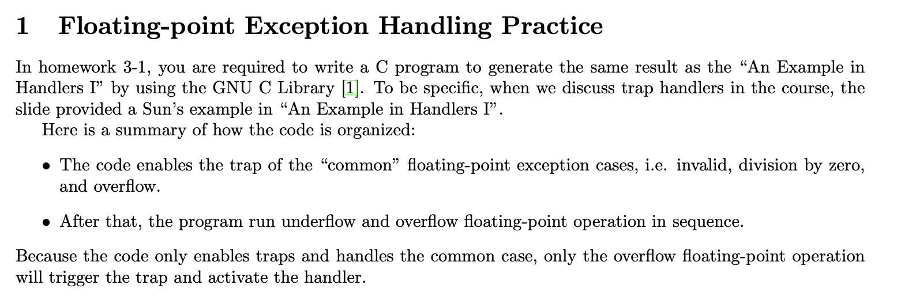

# Chapter 1: Unix System Overview

# 1.1 Logging In

當登入一個系統時，會先去查找`/etc/passwd` 這個檔案，這個檔案的 format 如：

| the login name | encrypted passwd | numeric user ID | numeric group ID | a comment field | home directory | shell program |
| --- | --- | --- | --- | --- | --- | --- |
| root | x | 0 | 0 | root | /root | /bin/bash |


之後，會依照使用者的 shell program 欄位來執行對應的 shell program，shell program 就開始讀使用者的輸入，並執行對應的指令。

# 1.2 Files and Directories

## Directory

UNIX 系統中，檔案系統可以會從 root`/`開始，而檔案系統中會包含 directory 和 file，其中：

directory 就是包含 directory entries 的檔案，一個 directory entry 就會有 file name 和一連串的屬性，這些屬性有：

- type of file: file, directory
- file size
- owner of the file
- permission of the file
- last modification time of the file

當一個 directory 被創建時，裡頭會自動包含 `.` 和`..` 兩個檔案名稱，分別代表上一個 directory 和當前 directory

## File Name

檔案名稱中唯二不能出現：

- slash character：用來區別出下一個層級
- null character：用來終止

## Path Name

Path name 又可以分成絕對路徑和相對路徑兩種：

- Absolute pathname：從 root 開始向下到欲存取的檔案位置
- Relative pathname：從當前路徑開始存取檔案位置

### Example for accessing the file names in current directory

```c
#include <dirent.h>
#include <stdio.h>
#include <assert.h>

int main(int argc, char* argv[]) {
	assert(argc == 2);
	DIR *dp;
	struct dirent *dirp;
	dp = opendir(argv[1]);
	assert(dp != NULL);
	while ((dirp = readdir(dp)) != NULL) {
		printf("%s\n", dirp->d_name);
	}
	closedir(dp);
	return 0;
}
```

可以先來看一下 `<dirent.h>` 的定義：

[<dirent.h>](https://pubs.opengroup.org/onlinepubs/7908799/xsh/dirent.h.html)

> The internal format of directories is unspecified.
> 
> 
> The *<dirent.h>* header defines the following data type through **typedef**:
> 
> DIRA type representing a directory stream.
> 
> It also defines the structure **dirent** which includes the following members:
> 
> ```
> ino_t  d_ino       file serial number
> char   d_name[]    name of entry
> ```
> 
> The type **ino_t** is defined as described in *[<sys/types.h>](https://pubs.opengroup.org/onlinepubs/7908799/xsh/systypes.h.html)*.
> 
> The character array **d_name** is of unspecified size, but the number of bytes preceding the terminating null byte will not exceed {NAME_MAX}.
> 
> The following are declared as functions and may also be defined as macros. Function prototypes must be provided for use with an ISO C compiler.
> 

而這裡頭共有定義下面我們這裡用到的幾個 function 的prototype：

1. `DIR *opendir(const char **dirname*);`
2. `struct dirent *readdir(DIR **dirp*);`
3. `int closedir(DIR **dirp*);`

下面是一個 `readdir` 示範例子

```c
dirp = opendir(".");

while (dirp) {
    errno = 0;
    if ((dp = readdir(dirp)) != NULL) {
        if (strcmp(dp->d_name, name) == 0) {
            closedir(dirp);
            return FOUND;
        }
    } else {
        if (errno == 0) {
            closedir(dirp);
            return NOT_FOUND;
        }
        closedir(dirp);
        return READ_ERROR;
    }
}

return OPEN_ERROR;
```

## Working directory

每個 process 都會有一個 working directory，我們可以使用 `chdir` 來更改 process 的 working directory

# 1.3 Input and Output

## File Descriptors

在 UNIX 中，kernel 會用一個非負整數稱為 file descriptor 來辨別一個 process 所存取的 file。

因此， 當 process 要存取或是創建一個新的 file 時，kernel 會返回這個 file descriptor 的值給這個 process，process 就不會知道 file 的細節

## stdin, stdout, stderr

一般來說，當執行一個 program 時，shell會自動開啟三個 file descriptor，分別為：

- standard input
- standard output
- standard error

## Unbuffered I/O

unbuffered I/O 會提供 open, read, write, lseek, close 等等的檔案操作，只要提供 file descriptor 就可以。

### Example for copy stdin to stdout using unbuffered I/O

```c
#include <unistd.h>
#include <assert.h>

#define BUFFERSIZE 4096

int main(int argc, char *argv[]) {
	int n;
	char buf[BUFFERSIZE];

	while ((n = read(STDIN_FILENO, buf, BUFFERSIZE)) > 0) {
		ssize_t out_n = write(STDOUT_FILENO, buf, n);
		assert(out_n == n);
		assert(out_n >= 0);
	}
	return 0;
}
```

這裡 `<unistd.h>` 會定義一些 standard symbolic constants and types

我們這裡用到的就是 `STDIN_FILENO` 和 `STDOUT_FILENO`

- STDIN_FILENO: File number of *stdin*. It is 0.
- STDOUT_FILENO: File number of *stdout*. It is 1.
- STDERR_FILENO: File number of *stderr*. It is 2.

然而這裡使用 unbuffered I/O，我們需要自己去定義 BUFFERSIZE，這個 buffersize 會影響到我們程式的效能

而 read 會讀入 number of BUFFERSIZE bytes，並返回正確讀入的 number of bytes

## Standard I/O

standard I/O 對比 unbuffered I/O 會提供 buffered interface ，我們就不用自己去定義 BUFFERSIZE 決定 optimal buffer size

舉例來說 fgets() 會直接一次讀入一行

### Example for copy stdin to stdout using standard I/O

```c
#include <stdio.h>

int main(int argc, char *argv[]) {
	int c;
	while ((c = getc(stdin)) != EOF) {
		if (putc(c, stdout) == EOF) printf("error");
		if (ferror(stdin)) printf("error");
	}
	return 0;
}
```

# 1.4 Programs and Processes

## Program

Program 只是存在 disk 中的可執行檔案而已，kernel 實際跑這些檔案會使用 `exec()` 來將它讀到 memory 並執行。

## Process and Process ID

實際正在執行的 program 稱為 process，而每個 process kernel 會用一個 identifier 為 pid 來區別，pid 必定為非負整數。

我們可以使用定義在 <unistd.h> 裡的 getpid() 來得到一個 size_t 的 pid 值得知當前執行 process 的 pid

### Example for getting pid of the current process

```c
#include <stdio.h>
#include <unistd.h>

int main(void) {
	printf("Hello, my pid is %ld", (long)getpid());
	return 0;
}
```

## Process Control

而又一共有下面三個 function 可以做到 process control

- fork
- exec
- waitpid

### Example for process control

```c
#include <stdio.h>
#include <string.h>
#include <unistd.h>
#include <stdlib.h>
#include <sys/wait.h>

#define MAXLINE 4096

int main(int argc, char* argv[]) {
	char buf[MAXLINE];
	pid_t pid;
	int status;

	printf("%% ");
	while (fgets(buf, MAXLINE, stdin) != NULL) {
		if (buf[strlen(buf)-1] == '\n') {
			buf[strlen(buf)-1] = 0;
		}
		if ((pid = fork()) < 0) {
			printf("fork error");
			exit(-1);
		}
		else if (pid == 0) {
			execlp(buf, buf, (char *)0);
			exit(127);
		}
		if ((pid = waitpid(pid, &status, 0)) < 0) {
			printf("waitpid error");
			exit(-1);
		}
		printf("%% ");
	}
	return 0;
}
```

首先，fgets 會一次從 stdin 讀進一行的字串到 buffer 中，

因為 execlp 會以 null 來判斷是否為 terminate，所以我們將 fgets 讀進來最後的換行符號換成 null 值。

當使用 process 執行 fork() 時，會創建一個 child process，如果 fork() 失敗時，會回傳一個負數的值，成功時，parent process 要得到 child process id，而 child process 則得到 0 值

之後 parent process 會使用 waitpid，來等待 child process 執行結束。

該 program 的唯一問題在於無法處理當欲替換程式有 argument 時的情況。

# 1.5 Error Handling

通常 UNIX 的 system library function 會以負值或是 null pointer 來作為 return value 來判斷是否有 error，而會使用一個 `errno` 來作為 error 的原因的標誌

舉例來說，當我們使用 `open` 來開啟檔案時，-1 代表有錯誤發生，但一共可能有 15 種錯誤，這時，我們就可以利用 `errno` 來判斷錯誤原因。

而 `errno` 會定義在 `<errno.h>` 中，並且裡頭會定義好哪個 errno 的值代表什麼原因的 error

因為支援 multithreaded 的緣故，早期的 errno 的宣告方法：

```c
extern int errno;
```

可能會造成不同 thread 存取到相同的 errno 造成的 race condition

因此，現今的方法是每個 thread 會有一份自己的 local copy errno

```c
extern int *__errno_location(void);
#define errno (*__errno_location())
```

而使用 errno 有幾點需要注意的是：

1. 因為在沒有 error 發生前，errno 的值不會為一定值，我們必須先對是否發生 error 做判斷，再使用 errno
2. errno 的值必不為 0

而在 `<string.h>` 中，有 strerror 可以幫助我們去 print error message

```c
#include <string.h>

char *strerror(int errnum);
```

而 `<stdio.h>`中的 perror 則會產生 error message 到 stderr 中

```c
#include <stdio.h>

void perror(const char *msg);
```

### Example for error handling

```c
#include <stdio.h>
#include <string.h>
#include <errno.h>

int main(int argc, char* argv[]) {
	fprintf(stderr, "EACCES: %s\n", strerror(EACCES));
	errno = ENOENT;
	perror(argv[0]);
	return 0;
}
```

## Error Recovery

而 error 又可以分為 fatal 和 non-fatal 兩種，

一般處理 error 的方式是直接在使用者螢幕上 print error message 並 exit，

但對於 non-fatal 的 error 來說，如 ENOMEM 有時是當下硬體資源不足，可以使用 delay-retry 技巧等其他 process 釋放使用資源，就有足夠記憶體可以繼續執行，此時就能做 error recovery，

而 non-fatal error 會有下面幾種：

- EAGAIN, ENFILE, ENOBUFS, ENOLCK, ENOSPC, EWOULDBLOCK
- ENOMEM, EBUSY
- EINTR

# 1.6 User identification

## User ID

在 `/etc/passwd` 可以看到，每個 user 會有個 column 是 user id 的數值，kernel 會以該 user id 來辨別使用者

而 user id 為 0 的使用者稱為 root，root 使用者會有特別的 privilege

## Group ID

在 `/etc/passwd` 同樣可以看到，每個 user 會有個 column 是 group id 的數值，kernel 會將 user 劃分成不同的 group，在相同的 group 的使用者可以共享某些資源

而在 `/etc/group` 中則可以看到 group name 和 group id 的 table

檔案系統會記錄一個檔案 owner 的 user id 和 group id，如果是用字串也就是 group name 或是 user name 來辨別的話，會多出額外的 disk 空間來儲存這些資訊

另外是字串的比對會比數值的比對來的更為複雜，因此最後才決定以一個 unique 的數值方式去儲存 user id 和 group id 

### Example for printing the user id and group id

```c
#include <unistd.h>
#include <stdio.h>

int main(void) {
	printf("uid: %d, gid: %d\n", getuid(), getgid());
	return 0;
}
```

# 1.7 Signals

當 process 執行時有狀況（不一定是 error）發生時，會利用 signal 來通知，舉例來說，當對某個值除以 0 時，會得到 SIGFPE (floating point exception signal)，

而我們就必須對 signal 去做額外的處理，處理的方法有幾種：

- 不管 signal，但這可能造成程式出現不預期的行為
- 針對 signal 定義一些 default action
- 提供特定的 function 來 catch signal

而當我們在 process 執行時使用 ctrl + C 時，其實就是會發出一個 interrupt signal，並終止該 process，但這樣一來，我們系統的 kernel 必須要有辦法在 process 執行時送 signal 給 process。

### Example for the signal handling

同樣在數值方法的作業中就有使用到類似的技巧：



```c
#include <stdio.h>
#include <fenv.h>
#include <float.h>
#include <signal.h>
#include <setjmp.h>

sigjmp_buf buffer;

void fp_handler(int sig) {
    fprintf(stderr, "SIGFP is catched!\n");
    if (sig == SIGFPE) {
        siglongjmp(buffer, 1);
    }
    else {
        signal(SIGFPE, fp_handler);
    }
}

int main(void) {
	feenableexcept(FE_INVALID | FE_DIVBYZERO | FE_OVERFLOW);
    signal(SIGFPE, fp_handler);

	double x = DBL_MIN;
    printf("min normal = %g\n", x);
	x = DBL_MIN / 13.0;
    printf("min normal / 13.0 = %g\n", x);
	x = DBL_MAX;
    printf("max normal = %g\n", x);

    if (sigsetjmp(buffer, 1) == 0) {
        x = DBL_MAX * DBL_MAX;
    }
    else {
        fedisableexcept(FE_OVERFLOW);
        x = DBL_MAX * DBL_MAX;
        printf("max normal * max normal = %g\n", x);
        feenableexcept(FE_OVERFLOW);
    }
	return 0;
}
```

### Example for signal handling

```c
#include <stdio.h>
#include <signal.h>
#include <unistd.h>
#include <sys/wait.h>
#include <stdlib.h>
#include <string.h>

#define MAXLINE 4096

static void sig_int(int);

int main(void) {
	char buf[MAXLINE];
	pid_t pid;
	int status;

	if (signal(SIGINT, sig_int) == SIG_ERR) {
		perror("signal error");
	}

	printf("%% ");
	while (fgets(buf, MAXLINE, stdin) != NULL) {
		if (buf[strlen(buf)-1] == '\n') buf[strlen(buf)-1] = 0;
		if ((pid = fork()) < 0) perror("fork error");
		else if (pid == 0) {
			execlp(buf, buf, (char *) 0);
			exit(127);
		}
		if ((pid = waitpid(pid, &status, 0)) < 0) {
			perror("waitpid error");
		}
		printf("%% ");
	}
	exit(0);
}

void sig_int(int signo) {
	printf("interrupt\n%% ");
}
```

這邊可以自己定義針對 SIGINT 這個 signal 的 handling function，如這裡的 sig_int

當 process 接收到 SIGINT signal 時，會 print 出 interrupt 字串

# 1.8 Time Values

在 UNIX 系統中共會有兩種 time values：

- Calendar time：從 UTC 到現在的秒數，會以 `time_t` 的資料型態來存
- Process time：通常稱為 CPU time，用來量測一個 process 使用某個 processor 的時間，通常是以 clock ticks 為單位，會以 `clock_t` 來存

而當我們量測一個 process 的時間時，共會得到：

- clock time
- user CPU time：由 user instructions 貢獻的 CPU time
- system CPU time：由 system services 貢獻的 CPU time

可以使用 `time` command 來量測一個 process 的時間

# 1.9 System Calls and Library Functions

Unix 系統中會限制 system call 的 必須和 C library 是同樣一個 function name，user process 只要透過 C library 的 function call，就能使用到這些 kernel service，不用去管實際系統中的 system call 差別

但 library function 可能會使用到多個 system call，而也可能不會用到任何 system call

以一個 C library 中的 `malloc()` 為例，memory allocation 有很多種方式如 best-fit, first-fit, worst-fit，而其中會使用 UNIX system call 中的 `sbrk` 來增加一個 process 的 address space

system call sbrk 會請求 kernel 去 allocate 額外的空間給 process，而 user 則透過 library function malloc 來不直接操作 system call，使底層實作細節抽象化，較容易使用